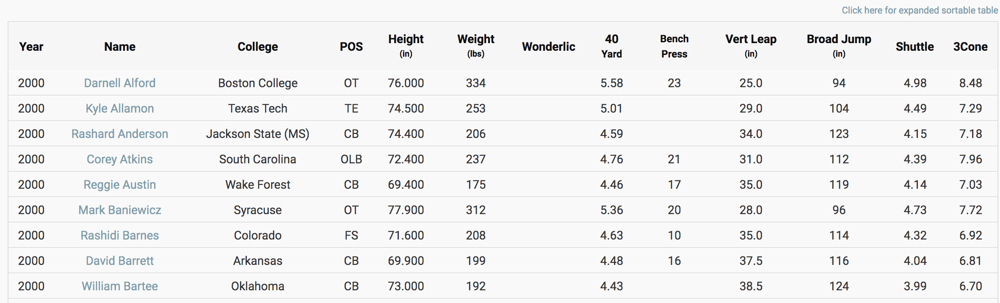
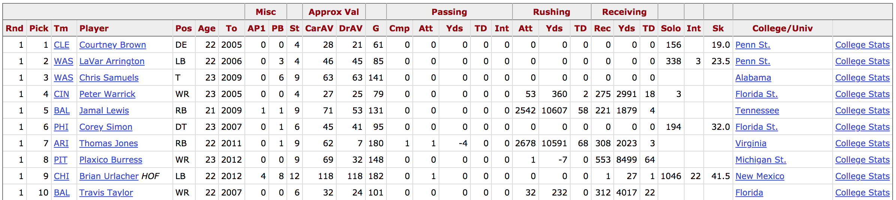
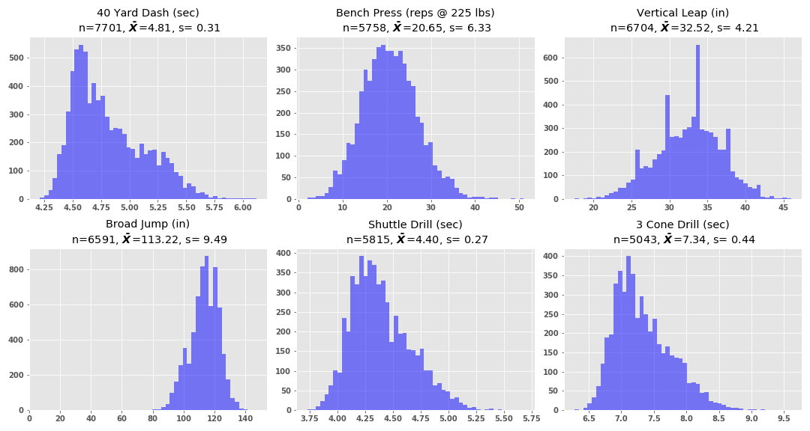

# 
You Can't Coach Speed

#### 
by Alex Diaz-Clark

An investigation into whether or not top-performers in the 40-yard dash are selected in the 1st round of the NFL Draft more often than top-performers in the other NFL Combine drills

## Background
Early in the offseason, usually in February, the National Football League (NFL) hosts a few hundred of the top college football players at the NFL Scouting Combine where coaches, scouts, doctors and executives evaluate the players to better inform their choices in the upcoming NFL Draft. More than 300 prospects were in attendance at the 2020 NFL Combine.

Here is a brief breakdown of the six main measurable drills at the NFL Combine [as described by the NFL](http://www.nfl.com/combine/workouts):

* The **40-yard dash** is the marquee event at the combine. It's kind of like the 100-meters at the Olympics: It's all about speed, explosion and watching skilled athletes run great times. These athletes are timed at 10, 20 and 40-yard intervals. What the scouts are looking for is an explosion from a static start.

* The **bench press** is a test of strength -- 225 pounds, as many reps as the athlete can get. What the NFL scouts are also looking for is endurance. Anybody can do a max one time, but what the bench press tells the pro scouts is how often the athlete frequented his college weight room for the last 3-5 years.

* The **vertical jump** is all about lower-body explosion and power. The athlete stands flat-footed and they measure his reach. It is important to accurately measure the reach, because the differential between the reach and the flag the athlete touches is his vertical jump measurement.

* The **broad jump** is like being in gym class back in junior high school. Basically, it is testing an athlete's lower-body explosion and lower-body strength. The athlete starts out with a stance balanced and then he explodes out as far as he can. It tests explosion and balance, because he has to land without moving.

* The **3 cone drill** tests an athlete's ability to change directions at a high speed. Three cones in an L-shape. He starts from the starting line, goes 5 yards to the first cone and back. Then, he turns, runs around the second cone, runs a weave around the third cone, which is the high point of the L, changes directions, comes back around that second cone and finishes.

* The **short shuttle** is the first of the cone drills. It is known as the 5-10-5. What it tests is the athlete's lateral quickness and explosion in short areas. The athlete starts in the three-point stance, explodes out 5 yards to his right, touches the line, goes back 10 yards to his left, left hand touches the line, pivot, and he turns 5 more yards and finishes.

At the NFL Draft in April, the teams take turns selecting players to join their them for the upcoming season. Each team starts with one draft pick in each of the seven rounds, but teams are allowed to negotiate trades with each other that can include any of their draft picks. So it is common to see a team with multiple draft picks in the same round. Once the draft is concluded, each team has their incoming rookie class.

After the draft, teams can then sign the players they drafted to a "rookie contract", which is typically a length of four years. The rookie contracts are structured due to collective bargaining and there is a big difference in the amount of money offered to a player selected in the 1st round vs the amount offered to a player selected in another round. On their rookie contracts, the signing bonus refers to the amount of money that is guaranteed to be paid to the player, regardless of their performance in the NFL, as long as the player avoids suspension and actually shows up to the games and practices. Here is a breakdown of the range of estimated signing bonuses on 2020 rookie contracts per round from [OverTheCap.com](https://overthecap.com/draft/):

* 1st round: $5.43 million - $23.88 million
* 2nd round: $1.37 million -  $3.88 million
* 3rd round: $0.83 million -  $1.16 million
* 4th round: $0.49 million -  $0.82 million
* 5th round: $0.24 million -  $0.35 million
* 6th round: $0.13 million -  $0.21 million
* 7th round: $0.08 million -  $0.11 million

As you can see, there is a financial incentive for a player to perform well at the NFL Combine, increasing their draft stock to hopefully be selected in the 1st round. There is also a financial incentive for teams to make sure they use their 1st round draft picks on the players they value the most.

As the old football saying goes, "you can't coach speed." This refers to the idea that while most other skills and attributes can be greatly improved after entering the NFL, elite speed is something a player has or doesn't. Sure, poor running mechanics can be improved, but this is typically done in college, or in preparation for the NFL Combine. 

I believe that NFL coaches, scouts and executives value top-end speed more than any other physical attribute measured in the six main NFL Combine drills. Therefore, my research hypothesis for this investigation is that top-performers in the 40-yard dash are selected in the 1st round of the NFL Draft at a higher frequency than top-performers in any of the other 5 drills.

## The Data

Results from the NFL Combine are tracked by [NFLCombineResults.com](https://nflcombineresults.com/nflcombinedata.php?year=2000&pos=&college=) and are available in sortable tables for each year, as shown below. Data is available beginning with the 1987 NFL Scouting Combine, and up to the 2020 Combine.

Also, results from the NFL Draft are tracked by [Pro-Football-Reference.com](https://www.pro-football-reference.com/years/2000/draft.htm) and are also available in sortable tables for each year, again shown below. Data is available beginning with the 1936 NFL Draft, and up to the 2019 Draft.

The data collected for this investigation begins with the 1994 Draft, where the NFL transitioned to a seven-round draft format, and continues until the 2019 Draft. Although the 2020 Combine has been completed, the 2020 Draft has not been conducted at the time of this investigation, so 2020 will cannot be included.

A player was determined to be a "top-performer" in a Combine drill if they recorded a score in the top 10% within their draft year, and grouped by position. The draft year groupings were necessary because players are only competing to be a 1st round draft pick with players from their own draft year. The position grouings were necessary because of the vast differnces in physical makeup of the players at different positions. For example, the fastest of the 300-lb Offensive Tackles would not be considered a top-performer if grouped together with the speedy Wide Recievers. 

While considering the top 10% to be top-performers may seem arbitrary, that cutoff was chosen because there are 32 players selected in the 1st round of the Draft, while over 300 players were at the Combine. This means roughly 10% of Combine participants have a chance of being drafted in the 1st round.

To begin the process of getting the data ready for hypothesis testing, a Python script (available in this repository at 'src/web_scraping.py') was written to perform the following actions:
1. Loop through each year's web page at both sites 
2. Scrape both web pages for their source code 
3. Store each source code as an entry (single string) in a collection in a database located on a Mongo server running in a Docker container

Next a script ('src/parsing_and_storing.py') was written which performed these actions:
1. Extract the portion of each source code's string containing the table
2. Parse each table into individual rows
3. Store each row as an entry in a new collection on the same MongoDB. This resulted in one collection for the draft results and a seperate collection for the combine results.
4. Import the data into a Pandas DataFrame, initially cleaning the column names
5. Store the draft and combine tables in seperate CSV files.
6. Store the draft and combine tables in seperate tables in a PSQL database on a postgres server running in a docker container.

The next script ('src/cleaning_data.py') performed final cleaning and joining of the tables:
1. Cast values to int/float for numeric columns
2. Edit mismatched player names between the two tables
3. Join the two tables and mark the players selected in the 1st round
4. Reorganized player positions into 14 position groups
5. Drop remaining uneeded columns
6. Create a binomial sample of top-performers for each drill (grouped by position and year) with success (1) defined as being selected in the top 32 picks of the NFL Draft, and failure (0) defined as not being drafted in the top 32.
7. Create a dictionary for each sample parameter: sample size, mean, standard deviation and probability of success.

Once the data was cleaned and joined, I was free to explore the data and attempt to understand its distributions (using the script available at 'src/data_distibutions.py'). Looking at how the scores for each Comibine drill are distributed (all scores, not just the top-performers), the following figure was generated:

## Frequentist Hypothesis Testing

## Bayesian AB Testing

## Conclusion

## Potential Influencing Outside Factors

## Whats Next?
